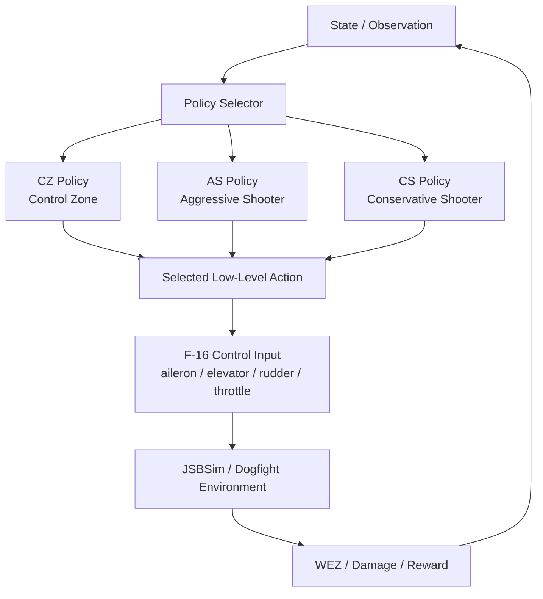

## 할당된 임무

1. 록히드마틴 / AlphaDogfight 논문 기반 reward 함수 적용
2. 비행 안정화 및 BT target 공격 bridge 학습
3. 학습 결과를 replay viewer로 확인 가능한 형태로 정리

## 1. Reward 함수 제작

록히드마틴 논문의 Table-I reward를 그대로 복붙한 것은 아니고, 대회 환경에 맞게 변환해서 구현했습니다.

!image.png



!image.png

!image.png

!Table I: SAC 학습 하이퍼파라미터

Table I: SAC 학습 하이퍼파라미터

논문 내용 :

- WEZ: 기수 앞 2도 cone, 거리 500~3000 ft
- damage: 500~3000 ft 안에서 가까울수록 커짐
- low-level policy reward:
    - CZ = relative position + closure + blue gunsnap + red gunsnap + deck + too close
    - AS = track angle + blue gunsnap + red gunsnap + deck
    - CS = AS와 비슷하지만 gun snap reward plateau가 다름
- policy selector reward:
sparse WEZ damage + 매 step track angle 보상

원본 대회 Release 기준

```jsx
원본 기본:

SAC MLP
기본 reward
tactical16 observation 사용 가능
target_mode: behavior_tree
강한 LOS assist 없음
Lockheed Table-I reward 없음
```

Reward 파일:

my_reward_table1.py

들어간 항목은 다음과 같습니다.

```
track angle
adverse angle
relative position
closure
gunsnap
WEZ band
official WEZ aim
precision aim
altitude / safety guard
crash penalty
```

- 한 것
    - reward 함수 추가
        - 논문 reward 구조를 참고해서 relative position, track angle, closure, gunsnap, deck, too-close 계열을 구현.
    - 대회 환경용 보상 추가
        - 논문 그대로만 쓰면 추락/overshoot가 심해서 altitude guard, attitude guard, descent guard, action guard, speed penalty, WEZ hold, precision aim 등을 추가.
    - curriculum / YAML 실험 추가
        - fixed → loiter → BT 순서로 쉽게 시작해서 어려운 상대 쪽으로 옮기는 실험 파일들을 만들었음.
    - action_postprocess 사용/강화
        - PPO 모델 출력 뒤에 LOS assist, range assist, bank turn assist, safety filter를 붙여서 조종값을 보정.
        

처음에는 “논문 reward 하나를 잘 만들면 끝”이라고 생각했는데, 실제 학습을 돌려보니 상황별로 보상을 조금씩 바꿔야 행동이 바뀌었습니다.

예시:

1. 기체가 BT target을 따라가기도 전에 추락함
    
    → altitude guard, attitude guard, safety filter, target 뒤쪽 cone 보상을 추가
    
    → 추락이 줄고 target 뒤로 따라가는 행동이 생김
    
2. target을 따라가긴 하는데 조준을 못함
    
    → 실제 WEZ보다 넓은 cone, 즉 easy-angle / precision aim reward를 추가
    
    → 조준 방향으로 nose를 맞추는 행동이 생김
    
3. 실제 official WEZ에 안 들어감
    
    → official range 안에서 ATA를 줄이는 reward를 강화
    
    → 일부 개선은 있었지만 reward만으로는 한계가 있었음
    

```jsx
문제 1:
WEZ가 2도 cone이라 너무 좁음.
보상을 거의 못 받으니 학습이 잘 안 됨.

문제 2:
공격 보상을 세게 주면 기체가 추락하거나 overshoot함.

문제 3:
뒤를 따라가기는 하는데, 마지막 1~3도 조준을 못 맞춤.
```

결론적으로 reward 함수는 하나로 고정하기보다는 curriculum 단계별로 바꾸는 게 맞아 보입니다.

## 2. 시행착오

### Easy WEZ 1000m

처음에는 official range `914.4m`가 너무 빡세서 training-only로 `1000m`까지 넓혀봤습니다.

결과:

```
조준 신호는 생김
하지만 official 914.4m 기준으로는 잘 전이되지 않음
```

판단:

```
"조준은 되는데 사거리 밖이다"라는 진단에는 유용했지만 최종 해법은 아니었음
```

### Easy angle 4도 / 3도

official WEZ는 total 2도, 실제 half cone은 1도라 너무 좁았습니다.

그래서 training에서는 4도, 이후 3도로 줄였습니다.

결과:

```
일부 seed에서 official damage가 발생하기 시작
BT tail-chase bridge의 중간 단계로 유효했음
```

### Angle 2.5도

3도에서 2.5도로 바로 좁혔습니다.

결과:

```
24 iteration 동안 WEZ 0
보상 신호가 너무 희박해짐
```

판단:

```
너무 빨리 좁히면 학습이 죽음
```

### Precision reward 강화

3도 WEZ는 유지하고, official 1도 cone 쪽으로 precision reward를 강화했습니다.

결과:

```
학습 중 angle3 WEZ는 많이 열림
하지만 official 2도 기준으로는 거의 개선 없음
```

판단:

```
reward만 좁게 준다고 official cone으로 충분히 전이되지는 않음
```

### Range assist 조정

처음에는 1000m 근처에서 조준이 잘 되고, 914m 안에 들어오면 조준이 흐트러져서 range 문제라고 생각했습니다.

그래서 `range_assist.target_m`을 760, 800, 860, 900 등으로 바꿔봤습니다.

결과:

```
target_m을 올리면 아예 official range 안에 못 들어감
throttle을 약하게 해도 공격 기회가 줄어듦
```

판단:

```
문제는 단순히 "너무 빨리 접근함"이 아니었음
range는 기존 설정을 유지하고, 조준 보정을 강화하는 게 맞았음
```

## 3. 가장 큰 발견

기체가 target을 조준하는 순간은 있었습니다.

문제는 그 순간이 보통:

```
거리 약 1000m
```

근처였고, official WEZ range는:

```
914.4m 이하
```

입니다.

즉:

```
조준은 되는데 사거리 밖
사거리 안으로 들어오면 ATA가 다시 벌어짐
```

이게 핵심 문제였습니다.

## 4. 가장 잘 된 방법

Reward를 더 바꾸는 것보다 `metadata.json`의 `action_postprocess`에서 LOS assist를 강화한 것이 가장 효과가 좋았습니다.

최종 best bundle:

metadata.json

policy_weights.pkl.gz

방법 :

- 목표가 조준선 오른쪽/왼쪽에 있음
→ rudder / roll 보정
- 목표가 조준선 위/아래에 있음
→ pitch 보정
- 너무 가까움 / 너무 멂
→ throttle 보정
- 고도 낮음 / 자세 위험함
→ safety filter 보정

핵심 파라미터:

```
los_assist.rudder_gain: 9.5
los_assist.roll_gain: 0.80
los_assist.pitch_gain: 0.50
los_assist.az_ref_deg: 1.6
los_assist.el_ref_deg: 1.3

bank_turn_assist.disable_ata_deg: 0.0
bank_turn_assist.roll_gain: 0.12
bank_turn_assist.pull_gain: 0.05
```

## 5. 결과

최종 best `los95_bankmicro`:

```
seed8200 target health 0.9558 / WEZ 11.38
seed8400 target health 0.9779 / WEZ 4.75
seed8600 target health 0.9648 / WEZ 10.38
seed8800 target health 0.9715 / WEZ 5.25
```

20260705-0521-48.3836196.mp4

이 replay는 seed 8804이고:

```
target health 0.7717
official WEZ 42 step
```

까지 나왔습니다.

## 6. 현재 상태

우리가 완성한 것:

```
비행 안정화 기반
BT tail-chase 공격 bridge
official WEZ 진입 가능 후보 bundle
시각화 replay
```

아직 완성하지 못한 것:

```
완전한 dogfight policy
loiter target 대응
aggressive BT target 대응
merge 이후 turn fight
방어/회피 policy
HRL selector
self-play
```

## 7. 다음 방향

바로 self-play로 가기보다는 다음 순서가 좋아 보입니다.

```
1. 현재 best bundle을 기준으로 BT 초기 조건 다양화
2. 거리, 고도, 속도, heading offset randomization 확대
3. loiter target으로 확장
4. 더 강한 BT opponent로 확장
5. post-merge turn reward 추가
6. 상황별 policy 분리
7. HRL selector 구현
8. self-play
```